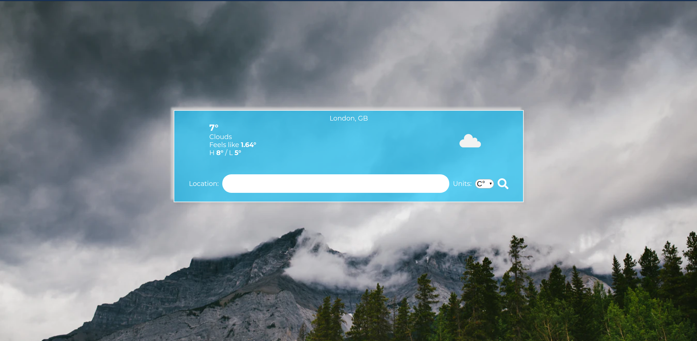

# Cloudier

> This project is a weather app that looks for a city and returns the most common information regarding the weather of the given city. It uses the OpenWeather API and handles all the assets through Webpack.




## Built With

- HTML5,
- CSS,
- Sass,
- Javascript,
- Webpack,
- OpenWeather API

## Installation

1. Clone the repository in your local folder.
```
git clone https://github.com/rociac/cloudier.git
```
2. Run
```
npm install
```
3.1 For running the project in a development enviroment
```
npm start
```
3.2 For running the project in a production enviroment (creates dist folder)
```
npm run build
```
3.2.1 Open index.html in your browser.

## Author

👤 **Rodolfo Cisneros**

- Github: [@rociac](https://github.com/rociac)
- Twitter: [@AcostaRca](https://twitter.com/AcostaRca)
- Linkedin: [linkedin](https://www.linkedin.com/in/rociac/)

## 🤝 Contributing

Contributions, issues and feature requests are welcome!

Feel free to check the [issues page](https://github.com/rociac/fat-food/issues).

## Show your support

Give a ⭐️ if you like this project!

## 📝 License

This project is [MiT](https://opensource.org/licenses/MIT) licensed.
